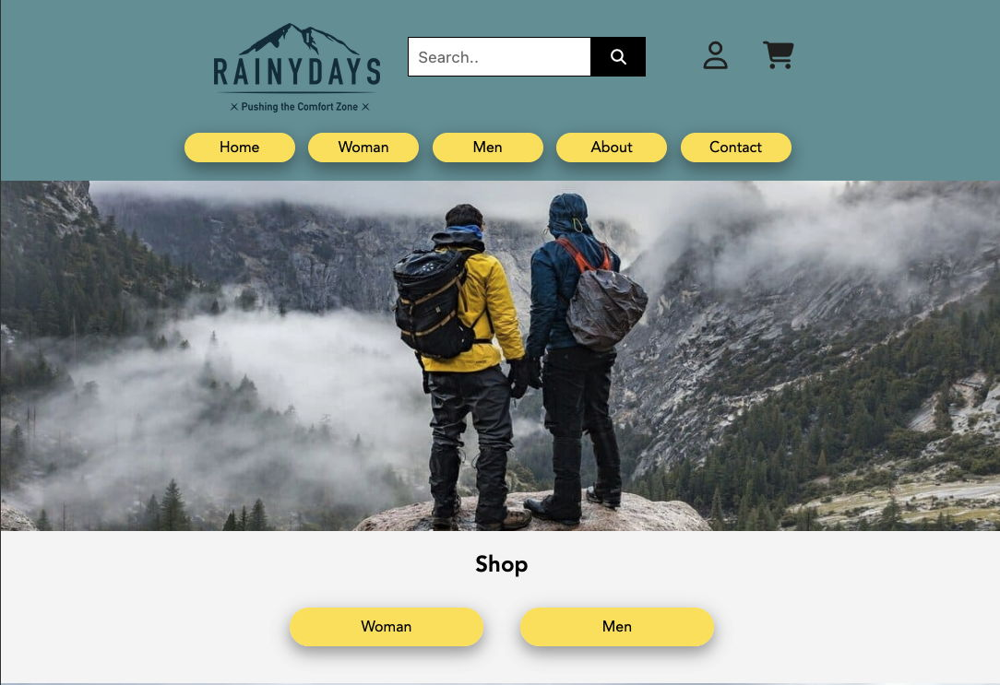

# Rainydays - My cross-course project


## Table of Contents
* [Screenshot](#screenshot)
* [General info](#General-info)
* [Built with](#built-with)
* [Getting started](#getting-started)
* [Links](#Links) 
* [Contact](#contact)

## General info
This project have contains two assignments
* My very first project
* Interaction Design
 
The first assignment was create a responsive website for a online shop, "Rainydays" who are selling men's and women rain jackets. This include creating design for website and HTML & CSS.<br>  
Interaction design is improvements on website and some small functionality using Javascript.


## Built with
This project is built with
- HTML & CSS
- Javascript

## Getting started
### Installing
```
1. Clone the repo
git clone https://github.com/chalund/Rainydays-cross-course-project-.git
```
## Links
[First draft](https://cute-kringle-2228a8.netlify.app/)  
[Updated version](https://joyful-lebkuchen-152596.netlify.app/)  
[Prototype in Figma](https://www.figma.com/file/z3JyoUhScZ6TmH3drBav7n/rainydays?node-id=644%3A1015&t=y2AQgSH1W3XgHmRh-1 )

## Contact


# Rainydays the updated version

Link to the old site: https://cute-kringle-2228a8.netlify.app/ (old)

Link to the updated version:  https://joyful-lebkuchen-152596.netlify.app/ (New)

Prototype in Figma https://www.figma.com/file/z3JyoUhScZ6TmH3drBav7n/rainydays?node-id=644%3A1015&t=y2AQgSH1W3XgHmRh-1 